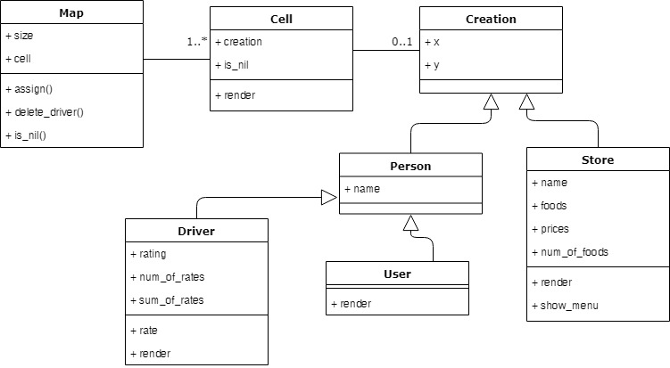

<h1 align="center">
  <br>
  CompFest Go-Eat Application
  <br>
</h1>

<h2 align="center">
  Muhammad Hendry Prasetya
  <br>
</h2>

<h3 align="center">
  Bandung Institute of Technology
</h2>

<p align = center> This repository link = [https://github.com/hendpraz/compfest-go-eat](https://github.com/hendpraz/compfest-go-eat) <p>

## Problem Description

You are going to make a command line app called “Go-Eat”. The app consists of drivers, stores, and a user. Every driver rated in the form of decimal number in the range of 0.0 to 5.0 and they will initially have 0 point of rating when the program runs for the first time. Each store has a menu which consists of item(s). The map which the user, drivers, and stores are placed on will be generated randomly and must be guaranteed that there is at least a path that can be taken for each driver to go to every store before finally proceeding to the user. Any additional logical assumptions is allowed.

## Assumptions

From the Problem Desciption's details, I assume that:
- The creations (user, drivers, and stores) must be placed on different coordinate. It will make the map unambiguos when it shown to the screen. It also guarantee that there is at least a path that can be taken for each driver to go to every store before finally proceeding to the user.
- A map must be wide enough to put all the creations on it. Otherwise, it will be invalid input
- A creation CAN move through other creation on the map.
- Random coordinate of places will generate randomly for maximum 4 attempts. If it's more than 4 attemps but the random coordinate is placed by another creation, the program will do sequential search to find the empty places in map
- The default menu of a store that generated randomly is a random menu
- User must rate the driver
- The money of the User is unlimited
- Two or more same menu in one order is allowed
- a valid coordinate starts from zero to n

## Design Decision

### Object Oriented Design



Classes:
- Map Class: Has attributes size and Array of Cell
- Cell Class: A Cell can contain a creation. If there are no creation, it will render "-"
- Creation Class: A Creation has a coordinate attributes, x and y
- Person < Creation: A Person has a name
- Store < Creation: A Store has a name, menu, and number of foods available. It will render "S"
- Driver < Person: A Driver has a rating, number of people who rates him/her, and sum of all ratings. It will render "D"
- User < Person:A User will render "U"

### Files

I use .txt format because it's easy to use.

Input file format (for Map and Creations):
```
10          #Map size
1 1         #User coordinate
4           #Num of drivers, 4 line below is each driver's coordinate
1 2
1 3
2 5
4 4
2           #Num of stores
2 4         #Coordinate of store
Pizza Hut   #Store name
2
Premium Pizza @ 80000
Cheese Burst Pizza @ 100000
4 6
Kabobs
1
Kebab + Sayuran @ 25000
```

Note: Ignore the comments with '#'<br>
Why I format the input like this?
- It has the same order with the steps of creating a map in other ways (pass 0 or 3 arguments)
- It's readable. The coordinate is placed on the same line
- It dont use to much line. The food and it's price are placed on the same line
- It doesn't make the program to check whether it is a menu, or a store name, or a coordinate. Because the number of store, driver and menu are written explicitly. So, the program knows how many loop needed

Output file format (for history):
```
Warung Nugroho
2
Kwetiaw Goreng @ 12000 x 2
Kwetiaw Goreng @ 12000 x 6
96600
Abdul
driver is on the way to store, start at (0,2)
go to (1,2), driver arrived at the store!
driver has bought the item(s), start at (1,2)
go to (2,2), driver arrived at your place!
---
```

Why I format the history like this?
- It's readable. The output file can be read well by user. The '---' can separate two orders.
- It has the same order with the steps of "Order Food" action: Choose store -> Choose Menu -> Get a Driver -> Display Driver's Route
- It's usable for "View History" action. The view history require the information on the file except driver's name and driver's route.

## Steps

I tried to use TDD steps 
1. Write code to process the arguments, test it
2. Design the Classes, apply SOLID, test it
3. Create the database for the whole program, test it
4. Create the "Show Map" feature, test it
5. Create the "Order Food" feature, test it
6. Create the "View History" feature, test it
7. Create the Driver Rating feature, test it
8. Handle Edge Cases
9. Refactor, Keep the Code DRY

## App Demo

A sample input output of the App


## Edge Cases Handled

I tried to handle:
- File not found
- Invalid coordinate, x and/or y is outside the map. Whether is from arguments or from input.txt file
- Invalid size of map. #1. Negative value #2. Value too small #3. Value is not integer
- Invalid input to select store
- Invalid input to select menu
- Invalid amount of item ordered
- Invalid input to rate the driver

## References

Indonesian names: [FaktaMuharam](http://faktamuharam.blogspot.com/2012/11/top-1000-nama-populer-di-indonesia.html)<br>
Diagram: [Draw.io](https://www.draw.io/)